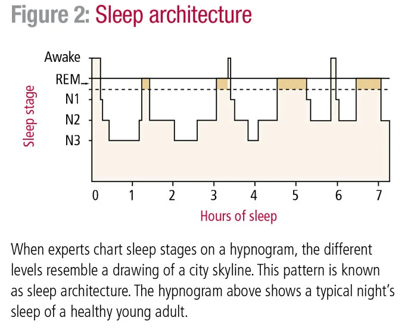

# Book Notes : Why we sleep

- [Book Notes : Why we sleep](#book-notes--why-we-sleep)
- [Part 1 : This Thing Called Sleep](#part-1--this-thing-called-sleep)
  - [Chapter 1](#chapter-1)
  - [Chapter 2](#chapter-2)
  - [Chapter 3 : Defining and Generating Sleep](#chapter-3--defining-and-generating-sleep)
    - [Self-identifying Sleep](#self-identifying-sleep)
    - [Self-assessing Sleep](#self-assessing-sleep)
    - [Two types of sleep](#two-types-of-sleep)
    - [Sleep Cycle](#sleep-cycle)
    - [How your brain generates sleep (incomplete)](#how-your-brain-generates-sleep-incomplete)

# Part 1 : This Thing Called Sleep
TBD
## Chapter 1
TBD
## Chapter 2 
TBD
## Chapter 3 : Defining and Generating Sleep
### Self-identifying Sleep
Identifying sleep seems trivial due to our experience, but these are done by the following characteristics:
1. Sleeping organisms have a stereotypical sleeping position
2. Lowered muscle tone (postural muscles ease and take shape of surface beneath)
3. No overt display of response/communication
4. Easily reversible
5. Sleep adheres to patterns

### Self-assessing Sleep
Sleep can also be self-assessed. We use two ways
1. **Loss of external awareness:** Sensory organs eyes, ears, nose, tongue, skin still send signals to the thalamus(in the brain). Thalamus sits like a perceptual barricade: it blocks sensory information in sleep. If they do get through, they reach the cortex.
2. **We lose track of time:** Explicit sense of time is lost. Further, in dreams, time is dilated. However note that your subconscious mapping of time remains precise (eg. you wake at 5:58am when you want to wake up at 6 to catch a flight). This mapping is not available to the conscious.

### Two types of sleep
There are two kinds of sleep, REM sleep(Rapid Eye Movement) and NREM(Non...) sleep. REM sleep brain activity is almost identical to those when awake, and also called dream sleep. NREM has 4 stages (imaginatively named NREM Stages 1-4), with 1 being the lightest, 4 being the deepest.

### Sleep Cycle
Every 90 minutes, sleep cycles through different stages of sleep (namely REM, NREM1, NREM2,...). The pattern is not uniform: **the deeper NREM stages dominate earlier on, and sleep becomes lighter as we move forward**.

**Loss of sleep:** An important consequence of this sleep cycle is the effects of loss of sleep. Assuming about 8 hours of sleep is enough. If you sleep at midnight, but wake up early for a meeting, say at 6 am, what amount of sleep is lost? We lose 25% of the total *BUT* you are actually losing 60-90% of REM sleep! On the opposite end, if you sleep late one day, your NREM/shallow sleep is lost!
> When it comes to sleep there is no such thing as burning the candle at both ends - or even one end - and getting away with it

### How your brain generates sleep (incomplete)
Brain activity measured in sleepers has shown two things: the closer to being awake you are, the more frenetic your brain waves. 
// to be done
Since we dream in REM sleep, the body tends to immobilize muscles in REM sleep. This is important because our brains send motor signals across the brain when dreaming and this may have unfortunate and severe consequences.